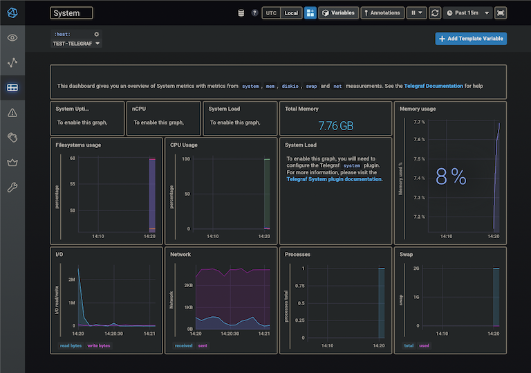

# TICK(Telegraf, InfluxDB, Chronograf, Kapacitor) stack

[](https://hits.seeyoufarm.com)

This repository can build a TICK stack easily and quickly using Docker.



## Features
* [Telegraf](https://docs.influxdata.com/telegraf/v1.18/)
   > A plugin-driven server agent for collecting & reporting metrics. \
the first piece of the TICK stack.
* [InfluxDB](https://docs.influxdata.com/influxdb/v1.8/)
   > A time series database designed to handle high write and query loads. It is an integral component of the **TICK stack**.
* [Chronograf](https://docs.influxdata.com/chronograf/v1.9/)
   > InfluxData’s open source web application. Use Chronograf with the other components of the TICK stack to visualize your monitoring data. \
   also, we are going to use it as InfluxDB admin.
* [Kapacitor](https://docs.influxdata.com/kapacitor/v1.6/)
   > An open source data processing framework that makes it easy to create alerts, run ETL jobs and detect anomalies. Kapacitor is the final piece of the TICK stack.


## Requirements
* [Docker](https://docs.docker.com/engine/install/)
* [Docker Compose](https://docs.docker.com/compose/install/)


## Installation
docker install script only for Linux OS (Ubuntu/CentOs)
```bash
# Install docker
$ sudo chmod 755 ./install-docker.sh
$ sudo ./install-docker.sh
```

## Build
Setting Environments and Build Docker volumes for TICK stack
```bash
# .env file
$ mv .env.example .env

# Create docker volume & network and Set directory owner & mode
$ make build
``` 


## Usage
By default, simply run as `make run` command.
```bash
# it means, `docker compose up`
$ make run
``` 
If you want to change `run` command, fix it in Makefile.
```bash
# fix `run` in Makefile.
# @docker compose --env-file ./.env -f ./workspace/tick-stack/docker-compose.yml up [SERVICE...]
$ make run
``` 


## Configuraion
* .env: related to `Makefile` and `workspace/tick-stack/docker-compose.yml`
```bash
# .env

# default docker volume path
DEFAULT_CONTAINER_VOLUME_PATH=/data/container/tick-stack

# docker volume
VOLUME_INFLUXDB_DATA=influxdb_data
VOLUME_CHRONOGRAF_DATA=chronograf_data
VOLUME_KAPACITOR_DATA=kapacitor_data

# docker network
NETWORK_TICK=tick-net

# version for official docker images
IMAGE_TELEGRAF=1.8-alpine
IMAGE_INFLUXDB=1.8.3
IMAGE_CHRONOGRAF=1.9.0
IMAGE_KAPACITOR=1.6.1
```

If you want to know about TICK stack services configuraion, [here](workspace/tick-stack/README.md)

## Structure
```bash
monitoring-tick-stack
├── install-docker.sh           # Install docker
├── README.md
├── Makefile                    # Build & Run script
├── LICENSE.md
└── workspace
   └── tick-stack               # TICK-stack workspace
      ├── docker-compose.yml    # related to `.env` and `Makefile`
      ├── influxdb.env          # influxdb init environment for docker service
      ├── chronograf.env        # chronograf init environment for docker service
      ├── README.md             # README for TICK-stack workspace
      ├── telegraf              # telegraf init directory (data, config)
      └── influxdb              # influxdb init directory (data, config)
      ├── kapacitor             # kapacitor init directory (data, config)
```

## License

The MIT License (MIT). Please see [License File](LICENSE.md) for more information.